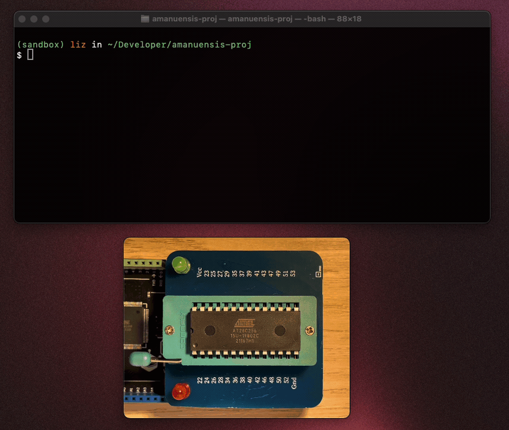
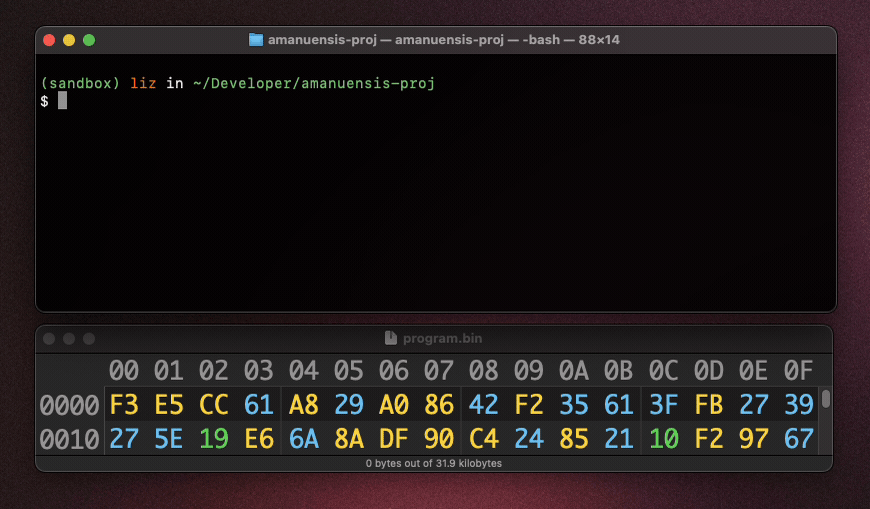
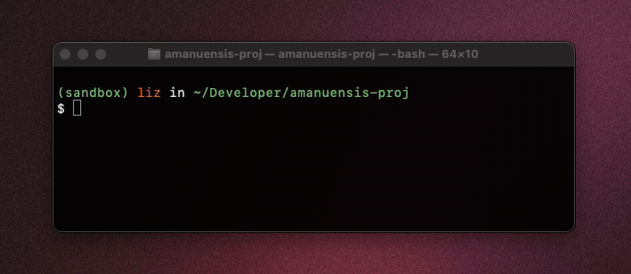
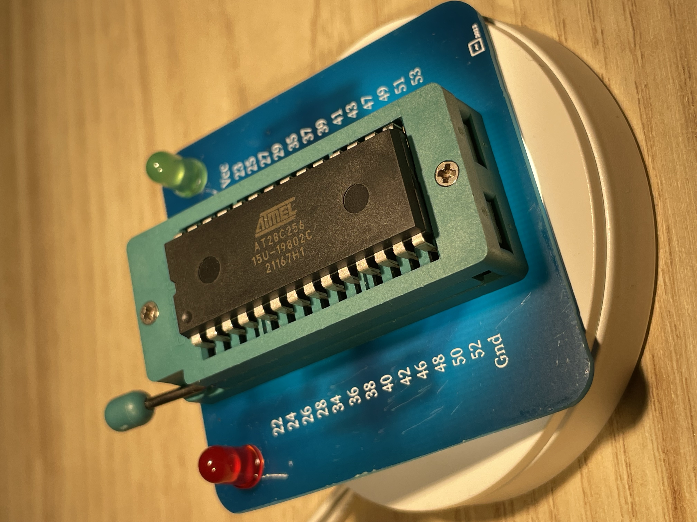
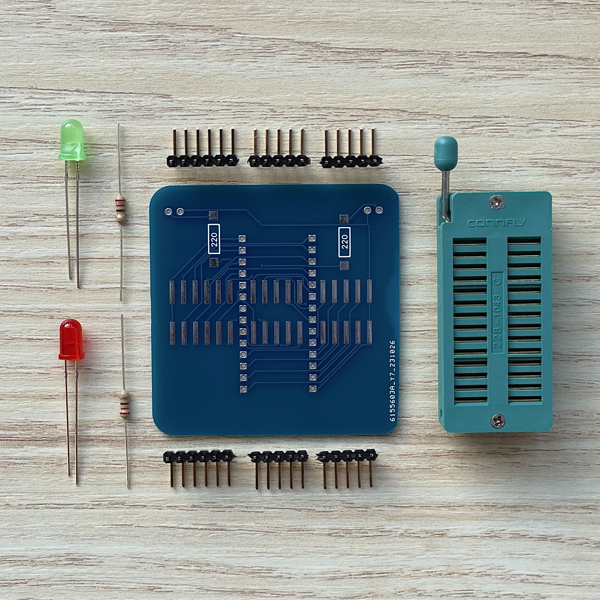
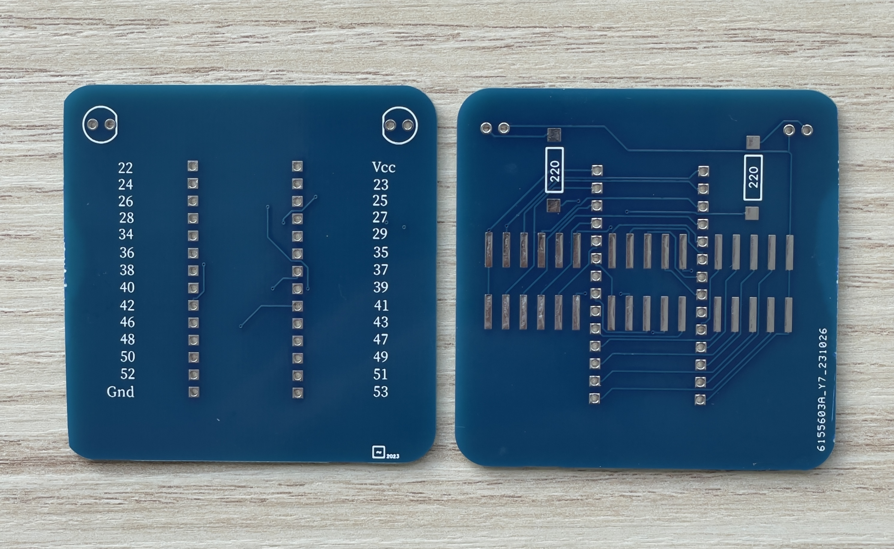
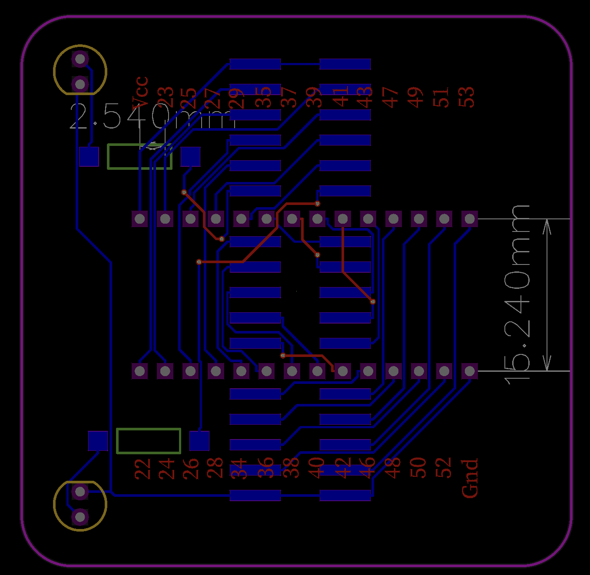

<p align="center">
 
</p>

### Amanuensis: Minimalistic EEPROM programmer for Ben Eater's 6502 8-bit PC.

---

### What does it do?

Amanuensis is a **CLI Tool** for easy interaction with EEPROMs. It was designed for the [28c256](https://ww1.microchip.com/downloads/en/DeviceDoc/doc0006.pdf) EEPROM, featured in [Ben Eater's 6502 8-bit PC course](https://www.youtube.com/watch?v=LnzuMJLZRdU).

Uses:
- Read blocks of memory.
- Burn a `.bin` file.
- Write to individual addresses.

<p align="center">
 
</p>

> **Note:**
> Software tested on **macOS**. It might be compatible with Linux-based systems with minor or no changes.

> **Warning:**
> Code intended for **28c256 EEPROM** which has 32K addresses each storing 8-bit values.
> Use for other parallel EEPROMs might be possible but you will have to adapt the code and the hardware. Check section [Use with other EEPROMs](#use-with-other-eeproms).

---

## Table of Contents

- **[Installation](#installation)**
- **[How To Use It](#how-to-use-it)**
- **[DIY Shield](#diy-shield)**
- **[Pin Mapping](#pin-mapping)**
- **[Inner Working](#inner-working)**
- **[Use with other EEPROMs](#use-with-other-eeproms)**

---

# Installation

1. Clone the repo:
   
       git clone https://github.com/ignigoliz/amanuensis.git

2. Create a virtual environment and install the `pyserial` library:

       pip install -r requirements.txt

3. Run the installation file to add the `nuensis` command to your bash terminal.
   
       ./install.sh

> **Note:**
> Restart the Terminal window after the installation to apply the changes

4. Test the installation by opening a *new* terminal window and typing:
      
       nuensis -h

> **Warning**
> The `install.sh` uses the current path of the repo to execute the code. If you move the repo from the folder where it was installed, you'll need to run the `install.sh` script again.

5. Upload `EEPROM_interface.ino` located in `src/arduino/` to your Arduino Mega board.

6. Wire the EEPROM to the Arduino Mega as described in the [pin mapping section](#use-with-other-eeproms).

# How To Use It

To see all available options:
```bash
nuensis read --help
nuensis write --help
```

#### Writting a File (`-f`):
```bash
nuensis write --file myfile.bin
```

<p align="center">
 
</p>

For it to work, `program.bin` should be a hexdump like the following

```python
#!/usr/bin/python3
rom = bytearray([0xea]*32768)

# `0xaa` stored in address `0x0000` and `0xbb` stored in `0x002b`.
rom[0x0000] = 0xaa
rom[0x002b] = 0xbb

with open("program.bin", "wb") as file:
  file.write(rom)
```

#### Writting to a Single Address (`--address | -a`):
```bash
# Writes value 0xef to address 0x0123
nuensis write --value 0123 ef
```

#### Overwritting the Whole Memory (`--whole | -w`):
```bash
# Writes value 0xea in all addresses.
nuensis write --whole ea
```

<p align="center">
 
</p>

> **Warning**
> This operation may take a while:

#### Reading a Single Memory Address (`--address | -a`):
```bash
# Reads address 0x0123
nuensis read --address 0123
```

#### Reading a Memory Range (`--range | -r`):
```bash
# Reads from address 0x0000 to 0x004f
nuensis read --range 0000 004f
```


#### Reading Whole Memory (`--whole | -w`):
```bash
nuensis read --whole
```

> **Note**
> EEPROM 28c256 has 15-bit memory registers. This means that memory addresses range from 0 (`0x0000`) to 32767 (`0x7fff`).


# DIY Shield

The shield conveniently maps Arduino Mega pins to the EEPROM pins as desribed in the section [Pin Mapping](#pin-mapping). I got mine fabricated but you can create yours in a protoboard.

<p align="center">
 
</p>

The hardware I needed for my shield are:

- 28 pin ZIF socket.
- 2x 220 ohm resistors
- 1x red LED, 1x green LED.
- 32x right angle pin headers.
  
<p align="center">
 
</p>

The Gerber files can be found at `pcb/`.

<p align="center">
 
</p>

<p align="center">
 
</p>

The shield can be crafted on a protoboard as well:

<p align="center">
 
</p>

<p align="center">
 
</p>

# Pin Mapping
The code provided expects certain Arduino Mega pins to be connected to certain EEPROM pins.

The Arduino Mega shield that I built implements such mapping. It is the following one:

> **Note**
> You can define your own mapping at `src/arduino/EEPROM_interface.ino`

| 28c256 Pin | Arduino Pin |
| :--------: | :---------: |
| WE         |   27        |
| OE         |   22        |
| CE         |   20        |
| D0         |   48        |
| D1         |   50        |
| D2         |   52        |
| D3         |   53        |
| D4         |   51        |
| D5         |   49        |
| D6         |   47        |
| D7         |   43        |
| A0         |   46        |
| A1         |   42        |
| A2         |   40        |
| A3         |   38        |
| A4         |   36        |
| A5         |   34        |
| A6         |   28        |
| A7         |   26        |
| A8         |   27        |
| A9         |   29        |
| A10        |   39        |
| A11        |   35        |
| A12        |   24        |
| A13        |   25        |
| A14        |   22        |

| LED        | Arduino Pin |
| :--------: | :---------: |
| GREEN LED  | 30          |
| RED LED    | 31          |

> **Note:**
> WE: Write Enable; OE: Output Enable; CE: Chip Enable; Dx: Data x; Ax: Address x


# Inner Working

The CLI Tool interacts with the Arduino over serial communication. The Arduino implements the low-level operations that read and write the EEPROM. Python parses the commands and performs simple logic to handle the requests, and then delegates the read/write operations to Arduino. As means to maintain both parties responsive, ACK (ACKnowledgment) signals are sent to notify received data.

The pulse cycles needed to drive the EEPROM can be found in the official datasheet of the [28c256 parallel EEPROM](https://eater.net/datasheets/28c256.pdf).

<p align="center">
 
</p>

# Use With Other EEPROMs

Amanuensis was designed for the 28c256 EEPROM which has 32K addresses. However, the code might be reused for other **parallel** EEPROMs just by adapting the pin mapping. This should be possible as long as they respond to the same read/write pulse cycles as the **28c256** (for example, the 28c64 is one of them). If you feel like hacking even deeper, you can adapt the pulse sequences (to be found in `arduino/EEPROM_interface.ino`).

<p align="center">
 
</p>

A few of the things that might have to be checked:
- Revisit the **pin mapping**.
- Adjust `MAX_ADDRESS` of your EEPROM in `./src/python/ArduinoInterface.py` and in `./src/arduino/EEPROM_interface.ino` (e.g., for 15-bit addresses, `MAX_ADDRESS=32767`).
- Make sure that the working voltage of the EEPROM is 5V or 3.3V (which is what Arduino provides).

<p align="right">
  
</p>
